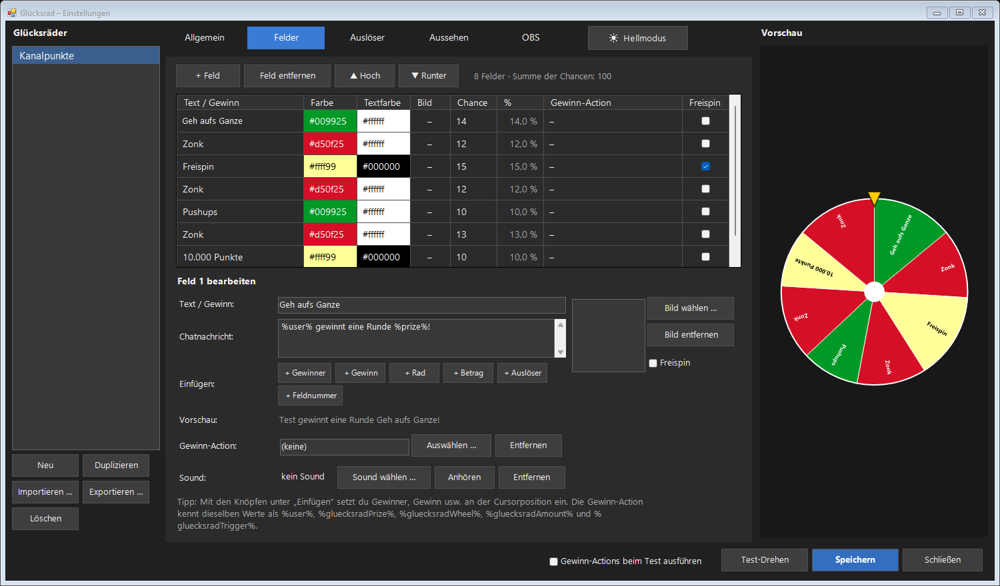

# Glücksrad für Streamer.bot & OBS

Ein animiertes Glücksrad für deinen Stream. Es dreht sich bei Kanalpunkten, Bits, Subs, Gift-Subs, Tipps oder per Chat-Befehl.
Alles wird in einem **Einstellungsfenster** eingerichtet, ohne HTML oder JavaScript anzufassen:

- beliebig viele Räder (z. B. „Kanalpunkte“ und „Donations“), per Datei exportier- und importierbar
- Felder mit Text, Farbe, Bild, Chance, Chatnachricht, Sound, Freispin und einer Gewinn-Action
- Chatnachrichten mit **Einfüge-Knöpfen** (Gewinner, Gewinn, Rad, Betrag, Auslöser, Feldnummer) und Live-Vorschau
- Zuordnung der Auslöser zu den Rädern (welche Belohnung, ab wie vielen Bits usw.)
- Aussehen: Drehdauer, Umdrehungen, Farben, Trennlinien, hohle Mitte, Bild in der Mitte, Zeiger,
  Gewinnfarbe, Texte ein/aus (nur Bilder), Bild-Ausrichtung, -Größe und -Abstand
- **Hell- und Dunkelmodus**, passt sich der Windows-Anzeigeskalierung an
- **OBS wird automatisch eingerichtet:** Pro Rad entsteht eine Szene `Glücksrad – <Name>` mit einer Browser-Quelle.
  Beim Speichern wird sie aktualisiert, und beim Umbenennen wird auch in OBS umbenannt.

## Voraussetzungen

- **Streamer.bot 1.0** oder neuer
- **OBS Studio 28** oder neuer, in Streamer.bot verbunden (*Stream Apps → OBS*)
- Der **WebSocket-Server** von Streamer.bot ist aktiv (*Servers/Clients → WebSocket Server*, „Auto Start“ an, Standard `127.0.0.1:8080`)
- Für Chatnachrichten: Twitch-Konto in Streamer.bot eingeloggt (*Platforms → Twitch*)

## Installation

1. Öffne [`dist/Gluecksrad_Import.txt`](dist/Gluecksrad_Import.txt) und kopiere den kompletten Inhalt.
2. Klicke in Streamer.bot oben auf **Import**. Steht dort noch ein alter Import, zuerst auf **Clear** klicken.
   Dann den Text einfügen und mit **Import** bestätigen (die Fragen zu C#-Code und zum Überschreiben mit **Yes**).
   Danach gibt es die Gruppe **Glücksrad** mit drei Actions:
   | Action | Zweck |
   |---|---|
   | **Glücksrad – Einstellungen** | öffnet das Einstellungsfenster |
   | **Glücksrad – Drehen** | hier hängst du alle Auslöser (Trigger) an |
   | **Glücksrad – Ergebnis** | wird vom Rad aufgerufen, wenn es stehen bleibt. Nicht verändern. |
3. Hänge an **Glücksrad – Einstellungen** einen Trigger, mit dem du das Fenster öffnest,
   z. B. *Core → Test* (dann Rechtsklick auf den Trigger → *Test Trigger*) oder einen Hotkey.
4. Richte im Fenster dein Rad ein und klicke auf **Speichern**. Streamer.bot legt in OBS dann die Szene
   `Glücksrad – <Name>` mit der Browser-Quelle an.
5. Damit das Rad im Stream zu sehen ist, wähle im Reiter **OBS** unter „Zusätzlich einfügen in“ deine Live-Szene.
   Alternativ ziehst du die Szene selbst als Quelle in deine Szenen. Das Rad ist nur während einer Drehung sichtbar.
6. Hänge in Streamer.bot an die Action **Glücksrad – Drehen** die Trigger an, die ein Rad drehen sollen:
   - Kanalpunkte: *Twitch → Channel Reward → Reward Redemption* (für jede Belohnung einen Trigger)
   - Bits: *Twitch → Chat → Cheer* (Min/Max leer lassen, der Mindestwert wird im Fenster eingestellt)
   - Subs: *Twitch → Subscriptions → Subscription / Resubscription / Gift Subscription / Gift Bomb*
   - Tipps: z. B. *StreamElements → Tip*, *Streamlabs → Donation*, *Ko-fi → Donation*
   - Chat-Befehl: *Core → Commands → Command Triggered* (den Befehl vorher unter *Commands* anlegen)
7. Lege im Reiter **Auslöser** fest, welches Rad bei welchem Ereignis dreht. Beispiel: Die Belohnung
   „Glücksrad“ dreht das Rad *Kanalpunkte*, Bits ab 500 drehen das Rad *Donations*.
8. Mit **Test-Drehen** probierst du alles aus. Die Chatnachricht bekommt dann den Zusatz `[Test]`.
   Gewinn-Actions laufen beim Test nur, wenn „Gewinn-Actions beim Test ausführen“ angehakt ist.

> **Update auf eine neue Version:** Beim erneuten Import ersetzt Streamer.bot die drei Actions komplett –
> **Trigger an „Glücksrad – Drehen“ und „Glücksrad – Einstellungen“ musst du danach wieder anhängen.**
> Deine Räder und Einstellungen bleiben erhalten.

## Felder & Gewinne

Oben siehst du alle Felder in einer Tabelle, darunter bearbeitest du das ausgewählte Feld.

| Einstellung | Bedeutung |
|---|---|
| Text / Gewinn | Name des Gewinns. Wird auf dem Rad angezeigt (abschaltbar unter *Aussehen*) und als „Gewinn“ im Chat verwendet |
| Farbe / Textfarbe | in der Tabelle anklicken, um die Farbe zu wählen |
| Chance | Gewichtung. Die Summe muss **nicht** 100 sein; der Anteil in % steht daneben. |
| Chatnachricht | wird im Chat gepostet. Werte wie Gewinner oder Betrag über die Knöpfe unter **Einfügen** einsetzen |
| Gewinn-Action | optionale Streamer.bot-Action, die beim Gewinn ausgeführt wird (mit Suche) |
| Bild | Bild für das Feld (PNG, JPG, GIF, WebP, SVG; max. 5 MB) |
| Sound | optionaler Sound beim Gewinn |
| Freispin | der Gewinner darf sofort noch einmal drehen |

Verfügbare Werte für Chatnachrichten (per Knopf einfügbar):

| Knopf | Platzhalter | Beispiel |
|---|---|---|
| Gewinner | `%user%` | Bittersweet1987 |
| Gewinn | `%prize%` | Zonk |
| Rad | `%wheel%` | Kanalpunkte |
| Betrag | `%amount%` | 500 (Bits, Spendenbetrag, Anzahl Gift-Subs bzw. Kanalpunkte-Kosten) |
| Auslöser | `%trigger%` | Kanalpunkte, Bits, Spende, Gift-Subs, Sub, Befehl, Freispin |
| Feldnummer | `%field%` | 3 |

Die **Gewinn-Action** bekommt dieselben Werte als Argumente:
`%user%`, `%gluecksradPrize%`, `%gluecksradWheel%`, `%gluecksradField%`, `%gluecksradAmount%`, `%gluecksradTrigger%` und `%gluecksradTest%`.
Zusätzlich werden die globalen Variablen `user` und `rouletteWin` gesetzt, damit ältere Roulette-Actions
(„Roulette Answer …“) ohne Änderung weiterlaufen.

## Aussehen – Bilder statt Text

Für Räder, deren Felder komplett aus Bildern bestehen (z. B. gestaltete „Tortenstücke“):

- **Texte auf dem Rad anzeigen** ausschalten
- **Bild-Ausrichtung** wählen: Oberkante zur Mitte, Oberkante nach außen, quer oder immer aufrecht
- **Bildgröße** (Länge vom inneren zum äußeren Ende, in % des Radius) und **Abstand zur Mitte** einstellen
- optional **Hohle Mitte** und ein **Bild in der Mitte** (z. B. Logo)

## Gut zu wissen

- Das Gewinnfeld wird **in Streamer.bot ausgelost**, nicht im Browser. Wird eine Browser-Quelle
  doppelt geladen, zählt das Ergebnis trotzdem nur einmal.
- Mehrere Drehungen hintereinander landen in einer Warteschlange und laufen nacheinander.
- Speichern während einer Drehung ist unkritisch: Die OBS-Quelle wird nur neu geladen, wenn sich das Aussehen
  geändert hat, und eine unterbrochene Drehung wird danach fortgesetzt.
- Ein Rad kann auch manuell gedreht werden: Setze vor dem Aufruf von „Glücksrad – Drehen“ das Argument
  `wheel` auf den Namen des Rads (z. B. mit einer *Set Argument*-Subaction). Zum Testen legt
  `gluecksradForceField` (Feldnummer) das Ergebnis fest.
- Die Overlay-Dateien liegen im Streamer.bot-Ordner unter `gluecksrad\rad_<id>.html`. Sie werden beim Speichern automatisch geschrieben.
- Die Einstellungen stehen in der persistenten globalen Variable `gluecksrad_config`.

## Für Entwickler

| Pfad | Inhalt |
|---|---|
| `overlay/overlay.html` | Overlay (Canvas, Animation, WebSocket). Mit `?demo=1` kann man es ohne Streamer.bot testen (Klick = Drehung). |
| `streamerbot/*.cs` | Quellcode der Actions. `Shared.cs` wird in jede Action eingefügt. |
| `tools/build_import.py` | baut `dist/Gluecksrad_Import.txt` und `dist/*.cs` |

Nach Änderungen: `python tools/build_import.py` ausführen und `dist/` mit committen.
